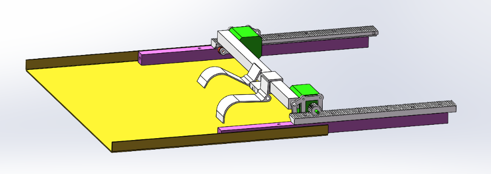

# 芦笋双目/三目视觉三维定位方案头脑风暴与总体架构

本项目旨在利用普通双目/三目相机，实现传送带上大致平行、存在叠加摆放的芦笋的三维高精度定位（Z轴深度及XY平面位置），以引导机械臂上的拨料拨钩机构完成精准拾取。

> [!NOTE]
> * **详细的参数选型（分辨率、焦距、FOV）与双目/三目方案对比**，请参阅独立文档《[相机选型与参数配置建议](camera_selection.md)》。
> * **详细的相机物理安装方式（大地独立/框架固定/臂载移动）及震动影响对比**，请参阅独立文档《[相机安装方式与机械震动分析](camera_mounting.md)》。

---

## 1. 核心约束与应用场景梳理

* **物体特征**：
  * 芦笋呈柱状，包含**绿色的主体**和**白色的根部**。
  * 直径范围差异巨大，约 **4 - 40mm**；长度范围约 **15 - 50cm**。
  * 在传送带上大致平行放置，夹角在 $\pm 15^\circ$ 以内，头部均朝向 $Y+$ 方向。
  * 芦笋之间存在**叠加和交叉**。
* **背景与环境**：
  * **传送带为黑色**，与芦笋（绿/白）有极高的视觉对比度。
  * **工作环境为完全封闭的室内环境**，无室外日光/阳光直射等不确定的环境光干扰。
  * **照明光源为完全受控的人工灯光**，光照条件恒定、稳定。
* **运动状态**：
  * 相机安装在机械臂上，随机械臂运动（Eye-in-Hand，臂载模式）。
  * 机械臂与芦笋的相对运动**仅存在于 X 轴方向**，Y 轴和 Z 轴相对固定（机械臂沿 X 轴方向往复平移）。
  * 传送带运行速度较慢，支持“步进式平移”（如每前进 100mm 停止一次，拍照识别后再移动），允许在拍照时完全停止。
* **执行机构（拨料拨钩机构）**：
  * 末端并非左右夹紧的夹爪，而是**L型旋转拨钩**结构。
  * 拨钩使用**舵机进行旋转控制**（而非垂直升降电机），旋转角度范围约为 45°。
  * 整个滑台机构依靠**步进电机**在 X 轴齿条上进行左右平移，无距离编码器，依靠 Homing 限位开关回零建立绝对坐标。
  * 拨料目标是**将最右侧的一根单根芦笋向右拨离**。当芦笋发生重叠/交叉时，多个拨钩通过独立的旋转动作与 X 轴往复平移的组合，将芦笋分离开并拨出。这需要高精度的 Z 轴深度数据以确定拨钩下落角度，以及 X 轴的精确位置以精准卡入芦笋之间的缝隙。

  

---

## 2. 定位精度评估与底层理论

双目视觉系统的深度测量误差 $\Delta Z$ 公式为：
$$\Delta Z = \frac{Z^2}{B \cdot f} \cdot \Delta d$$

其中：
* $Z$：相机到芦笋的垂直距离（工作距离）。
* $B$：双目相机的基线距离（两个镜头光心的距离）。
* $f$：镜头焦距（以像素为单位），$f_{\text{pixel}} = \frac{W_{\text{pixel}} \cdot f_{\text{mm}}}{S_{\text{width}}}$。
* $\Delta d$：视差匹配误差（像素级，传统算法一般在 $0.5 \sim 1.0$ 像素，深度学习视差匹配可达 $0.1 \sim 0.2$ 像素）。

---

## 3. 运动机构与几何补偿分析

本项目执行机构包含 **X 轴平移步进电机** 和 **旋转拨钩舵机**，其物理控制特性如下：

### 3.1 X 轴步进滑台的定位精度
* 滑台使用步进电机驱动，无距离编码器。
* 滑台配有 Homing 限位开关，每次启动时自动回零建立绝对坐标系统。
* **性能评估**：由于系统负载极小，且在视觉拍照或拨料时无高加速度突变，在控制中**无需考虑丢步（Step Loss）问题**。步进电机计步的重复定位精度通常可达 $\pm 0.05\text{ mm}$ 以内，完全能满足拨钩精准卡缝的要求。

### 3.2 L型旋转拨钩的 X-Z 几何耦合与侧效应

* 拨钩通过舵机进行旋转实现下落，摆动角度范围约为 45°。由于 L 型拨钩旋转时绕圆弧运动，这会引入 X 轴与 Z 轴的几何耦合（旋转弧形侧效应）。

* **拨钩几何参数**（依据机械图纸）：
  * 水平臂长 $L_h = 80\text{ mm}$，垂直臂长 $L_v = 40\text{ mm}$，材料截面厚度 $2\text{ mm}$
  * 旋转轴（Ø6 舵机轴）位于水平臂右端的安装座上
  * 拨钩尖端到旋转轴的极径：$R = \sqrt{L_h^2 + L_v^2} = \sqrt{80^2 + 40^2} \approx 89.4\text{ mm}$
  * 初始安装角度（图纸所示为**落下后的位置**）：落下位置尖端偏离垂直角 $\alpha_{\text{down}} = \arctan\frac{L_h}{L_v} = \arctan\frac{80}{40} \approx 63.4°$
  * 收起位置（逆时针旋转 $45°$）：$\alpha_{\text{up}} = 63.4° + 45° = 108.4°$（尖端位于旋转轴上方）

* **精确几何推导**：设 $\alpha$ 为拨钩尖端偏离垂直向下方向的角度。以旋转轴为原点，$+X$ 向右，$+Z$ 向下：
  $$X(\alpha) = -R \sin\alpha, \quad Z(\alpha) = R \cos\alpha$$

  拨钩从收起位置（$\alpha_{\text{up}} = 108.4°$）顺时针旋转 $45°$ 下落至图纸位置（$\alpha_{\text{down}} = 63.4°$）：

  | 物理量 | 收起位置 ($\alpha_{\text{up}} = 108.4°$) | 落下位置 ($\alpha_{\text{down}} = 63.4°$) | 变化量 |
  |:---|:---|:---|:---|
  | X（水平） | $-84.8\text{ mm}$ | $-80.0\text{ mm}$ | $\Delta X = +4.8\text{ mm}$（向右微量漂移） |
  | Z（深度） | $-28.3\text{ mm}$（轴上方） | $+40.0\text{ mm}$（轴下方） | $\Delta Z = +68.3\text{ mm}$（向下伸入） |

  **全程平均耦合比 $\Delta X / \Delta Z \approx 0.07$**（每下降 1mm，水平漂移仅 0.07mm）。**X 方向漂移几乎可以忽略。**

  这一良好特性的物理原因是：下落旋转过程经过 $\alpha = 90°$ 点，在该点处 $dX/dZ = \cot 90° = 0$（纯垂直运动），并且前半段的左移与后半段的右移大部分相互抵消：
  * **前半段**（$108.4° \to 90°$）：尖端向**左**漂移 $4.6\text{ mm}$，下降 $28.3\text{ mm}$
  * **后半段**（$90° \to 63.4°$）：尖端向**右**漂移 $9.4\text{ mm}$，下降 $40.0\text{ mm}$
  * 净效果：$9.4 - 4.6 = 4.8\text{ mm}$ 向右，占 $68.3\text{ mm}$ 下降行程的 $7\%$

  瞬时耦合比 $dX/dZ = \cot\alpha$，在旋转过程中先为负后为正：
  * 起始（$\alpha = 108.4°$）：$dX/dZ = -0.33$（下降时尖端反向左移）
  * 中点（$\alpha = 90°$）：$dX/dZ = 0$（纯垂直下降，零耦合）
  * 终止（$\alpha = 63.4°$）：$dX/dZ = +0.50$（下降时尖端右移）

> [!NOTE]
> 原文声称的 1:4 比例（$\Delta X / \Delta Z = 4$）与实际拨钩几何严重不符。基于图纸推导，实际全程平均耦合比仅约 **0.07:1**，X 方向总漂移不足 5mm。在步进电机 $\pm 0.05\text{ mm}$ 的重复定位精度下，**这 4.8mm 的固定偏置可以作为常数一次性补偿，无需复杂的实时联动控制**。

* **应对策略**（大幅简化）：
  1. **常数偏置补偿（首选）**：由于全程 X 漂移仅 $4.8\text{ mm}$ 且为固定值，可在标定时一次性测量并作为固定补偿量写入程序，无需实时计算。
  2. **精细补偿（可选）**：若拨钩不是每次都旋转完整 $45°$（例如根据芦笋高度调整下落深度），则需根据实际旋转角度 $\alpha$ 计算偏置 $\Delta X = R(\sin\alpha_{\text{up}} - \sin\alpha)$，或使用预计算查找表。

---

## 4. 标定与手眼对齐方案

### 4.1 1D 线性平移手眼标定的数学局限
* **几何约束**：由于相机采用 Eye-in-Hand 安装，需要确定相机到拨钩的相对空间转换。但由于滑台**仅能在 X 轴单向平移（Y/Z 轴相对固定）**。
* **数学冲突**：根据手眼标定方程 $AX = XB$ 的求解要求，机器人末端必须至少做两个不平行轴的旋转与位移。在纯 X 轴平移（一维自由度）下，三维手眼标定在数学上是欠定的、无法解出的。

### 4.2 简化的一维物理对齐标定
在降维系统下，可利用步进电机的超高精度和 Homing 零点，采用**物理对齐偏置校准**：
1. **X 轴偏置补偿 $d_{\text{cam\_offset}}$**：在传送带上放置一个细小标记物，移动滑台使相机图像中心完全对齐标记物，记录步进位置 $X_{\text{cam}}$；再移动滑台使拨钩尖端完全对齐该标记物，记录步进位置 $X_{\text{hook}}$。两者之差即为相机与拨钩在 X 方向的固定偏置常数：
   $$d_{\text{cam\_offset}} = X_{\text{hook}} - X_{\text{cam}}$$
2. **Z 轴标定**：使用 3 - 5 个已知高度的金属垫块置于传送带上。利用双目视觉计算各垫块的视差，并在拨钩下落刚触碰垫块表面时，记录舵机的动作角度。由此在程序中建立一个**一维“视差 - 舵机安全动作角度”的查找映射表**，直接规避复杂的 3D 手眼解算。

---

## 5. 算力与主控可行性分析 (PC vs 树莓派 5)

第一版算法在**笔记本电脑 (PC)**上进行开发与调试，成熟后再移植至**树莓派 5**。由于传送带是步进运动且拍照时会停顿，PC 上的处理耗时完全能实现实时响应。

| 任务模块 | 算法选型 | 树莓派 5 CPU 耗时估算 | 笔记本电脑 CPU 耗时估算 | 可行性与优化建议 |
| :--- | :--- | :--- | :--- | :--- |
| **双目畸变校正** | `cv2.remap` (基于查找表) | $\approx 10\text{ ms}$ | $\approx 1\text{-}2\text{ ms}$ | 耗时极低，完全可行 |
| **立体匹配 (深度图)** | OpenCV `StereoSGBM` (1024x768) | $\approx 70 \sim 100\text{ ms}$ | $\approx 15 \sim 25\text{ ms}$ | 采用小匹配窗口，PC上可轻松实时 |
| **高对比度目标分割** | HSV/OTSU 二值化 + 连通域边缘提取 | $\approx 5 \sim 15\text{ ms}$ | $\approx 1 \sim 3\text{ ms}$ | 在 CPU 上瞬间完成 |
| **边缘缝隙与高度决策** | 2D 边缘精细卡位 + 3D 高度投影 | $\approx 10\text{ ms}$ | $\approx 1\text{-}2\text{ ms}$ | 纯几何计算，速度极快 |

**结论**：
1. **PC 调试延迟**：PC 上的总视觉处理时延可轻松控制在 **50ms** 以内，支持 高帧率 的实时预览与参数交互调试。
2. **树莓派 5 移植**：在 1024x768 分辨率下，树莓派 5 的总时延约为 **100ms - 130ms**，远低于步进移动的机械动作周期，可行性极高。
3. **树莓派 5 USB 相机兼容性风险**：树莓派 5 的 USB 3.0 控制器在 Linux 下对 UVC 双目相机的兼容性需要提前验证。硬件同步触发需要 V4L2 扩展控制接口（`VIDIOC_S_EXT_CTRLS`）支持，部分工业相机驱动在 ARM Linux 上功能不完整。此外工业相机功耗较高，可能需要独立供电的 USB Hub。**建议在项目早期即在树莓派上完成相机驱动兼容性测试。**

---

## 6. 视觉成像层失效模式与风险防范 (FMEA)

为了确保本方案在实际分拣场景中的绝对可靠性，我们必须主动挑战和质疑该设计，找出潜在的**物理与算法失效点**，并制定防范措施：

> [!NOTE]
> * 关于“频繁启停导致标定漂移”的物理防范，请参阅 [相机安装方式文档](camera_mounting.md)。
> * 关于“微小余震要求硬件快门同步”的器件防范，请参阅 [相机选型文档](camera_selection.md)。
> * 以下为纯视觉成像与算法层的防范策略：

### 6.1 芦笋光滑圆柱面上的“高光反射（Specular Highlight）”导致深度图产生鬼影
* **风险描述**：芦笋表面湿润或打蜡时，在车间顶部光源照射下，表面会产生一条亮线状的强反光点（镜面反射）。由于左、右相机的视角不同，这个反光点在左右相机图像中的物理投影位置是不同的（它不符合物体的实际几何视差）。SGBM 算法如果强行去匹配这个高亮线，会误算出一个处于半空中的“鬼影”深度，导致拨钩定位错误。
* **防范措施**：
  1. **避免直射光源**，采用漫反射光源（如条形散射板或漫反射背光）。
  2. 在相机镜头前加装**偏振镜（Polarizer Filter）**，并在光源处加偏振片，通过正交偏振彻底消除金属或湿润表面的镜面高光。

### 6.2 极细芦笋边缘的“深度空洞（Invalid Disparity Holes）”
* **风险描述**：对于 4mm 的细芦笋，当其叠加在另一根芦笋之上时，由于左右相机 baseline 的视角差异，必然会产生深度匹配的盲区。在深度图上，这个盲区会被标记为“无效像素（0值）”。如果我们只依赖深度图来获取拨钩插入缝隙的 X 轴物理坐标，空洞会导致定位失效。
* **防范措施**：
  1. 采用**“2D 图像定 X，3D 深度定 Z”**的策略：不要在 3D 深度图上直接寻找缝隙。先用高分辨率的 2D 图像（无视角盲区）定位芦笋的边界，获得极精细的 X 轴卡位坐标；然后将该 X 坐标投影到深度图上，只在缝隙稍微偏内侧的安全区域查询 Z 轴（高度）值，避开深度图的边缘空洞。
