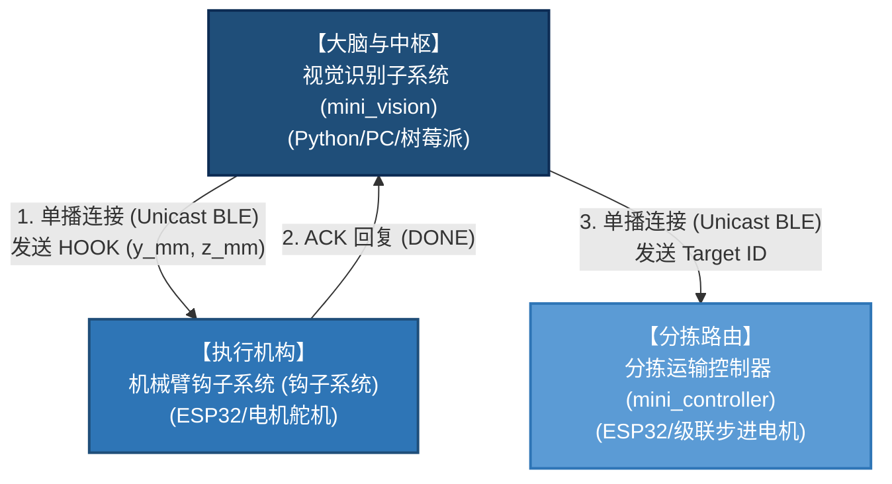
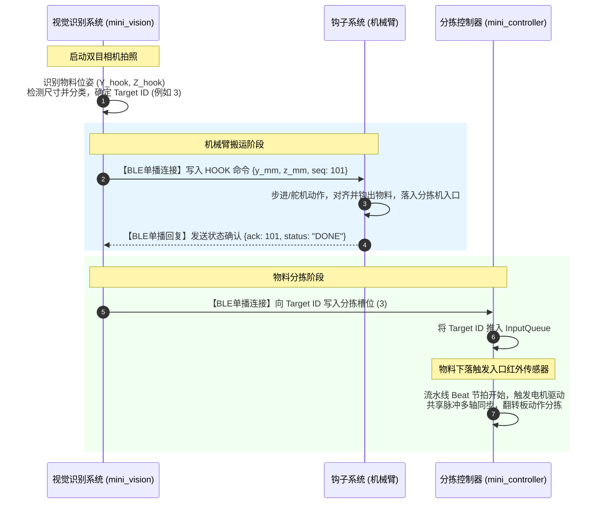

# 芦笋/螺丝分拣系统：系统顶层全局架构与通讯设计

> **本文档为整个分拣系统的系统级设计蓝图，定义了系统的全局拓扑结构、三大子系统的职责划分以及高可靠性通讯协议设计方案。**
> 所有下游子系统实现、接口开发以及集成测试均应遵循本文档所描述的规范。

---

## 系统的核心演进与物理对象说明
> [!NOTE]
> 本分拣系统原设计针对**长条状芦笋分拣**，但在实际应用中扩展支持**螺丝、螺栓等工业紧固件的分类与分拣**。
> 本文档采用通用对象术语（统称“物料”或根据上下文称为“螺丝/芦笋”），其底层运动控制逻辑与视觉坐标链在物理上高度一致。

---

## 一、 系统全局拓扑架构 (System Topology)

本分拣系统由三个独立但紧密协作的子系统构成，它们分别是**视觉识别系统**、**机械臂钩子系统**以及**分拣运输控制器**。系统全局数据流及执行逻辑呈“分时感知-指令执行-分拣路由”的三段式结构。



---

## 二、 三大子系统职责分工 (Subsystem Responsibilities)

### 2.1 视觉识别子系统 (Vision Subsystem - `mini_vision`)
- **角色定位**：整个分拣系统的“大脑”与主控制器（BLE Client/Master）。
- **主要职责**：
  1. **图像采集与校正**：通过固定于大地的双目立体相机（Eye-to-Hand 方案）采集传送带工作区的图像对，并进行立体校正（参见 [design_conclusion.md](file:///d:/Software/antigravity/sorter_mini_vision/docs/design_conclusion.md)）。
  2. **三维分割与层级检测**：检测视野内的芦笋或螺丝，计算其世界坐标位姿 `AsparagusPose`，并确定哪个在最上面（层级判断）。
  3. **位姿与终点决策**：
     - 计算最右侧待抓取物料的世界坐标 $(Y_{\text{hook}}, Z_{\text{hook}})$ 作为拨钩插入点。
     - 测量并分析物料的物理尺寸（如长度、直径），依据分类规则计算物料的**目标分拣槽位/出口 ID**（Target ID，范围 1~8）。
  4. **任务调度与通讯调度**：作为 BLE 客户端，分别以点对点（单播）连接方式向“钩子系统”发送运动轨迹目标，向“分拣运输控制器”发送分拣路由结果。

### 2.2 机械臂钩子子系统 (Robotic Arm Hook Subsystem - "钩子系统")
- **角色定位**：抓取物料的“执行手臂”（BLE Server/Peripheral）。
- **主要职责**：
  1. **坐标定位控制**：控制步进电机和舵机，根据视觉系统发送的坐标参数 $(Y_{\text{hook}}, Z_{\text{hook}})$ 控制滑台和拨爪精准运动。
  2. **物料移载**：从堆放平台上将螺丝/芦笋“钩”出，平移放置在运输分拣机入口的落料传感器检测范围内。
  3. **动作状态反馈**：当抓取放入动作完成后，向主控视觉系统发送确认包（`ACK: DONE`），通知视觉系统可进行下一次识别与调度。

### 2.3 分拣运输子系统 (Sorter Subsystem - `sorter_mini_controller`)
- **角色定位**：物理运输与路由的“流水线”（BLE Server/Peripheral）。
- **主要职责**：
  1. **节拍控制 (FSM)**：通过红外落料传感器检测物料落入，自动触发系统进入新节拍。
  2. **多级流水线维护**：维护一个包含 8 级状态的逻辑流水线 `_pipeline[8]`。
  3. **同步步进电机驱动**：通过“共享脉冲”高可靠性硬解耦架构，控制 M0 至 M7 级联翻转机构，执行“放行”或“剔除”动作（参见 [README.md](file:///d:/Software/antigravity/sorter_mini_controller/README.md)）。
  4. **目标接收**：通过蓝牙 BLE 接收视觉端写入的目标槽位 ID（Target ID），推入入料等待队列。

---

## 三、 通讯架构与 BLE 协议设计 (Communication & BLE Protocols)

为了应对生产环境中的无线电干扰，并确保物料搬运和分拣路径的绝对对齐，系统摒弃了不可靠的广播包通讯，全部采用**基于物理连接的单播点对点（Unicast Connection-Oriented）通信**，以提供底层硬件层面的 ACK 和重传机制。

### 3.1 视觉到钩子子系统通讯 (Vision ➔ Hook)
视觉系统采用点对点连接，向钩子系统特征写入 JSON 格式的指令包。

**HOOK 控制指令格式（Client ➔ Server Write）**
```json
{
    "cmd": "HOOK",
    "y_mm": 145.3,       // 机械臂 Y 轴绝对目标位置 [mm]
    "z_mm": 12.0,        // 拨爪 Z 轴插入高度 [mm]
    "seq": 101           // 消息序列号，递增
}
```

**钩子系统状态与确认回复（Server ➔ Client Notify）**
```json
{
    "ack": 101,          // 确认的 seq 序列号
    "status": "DONE"     // 执行状态: DONE(执行成功) / RUNNING(正在执行) / ERROR(发生异常)
}
```

---

### 3.2 视觉到分拣运输子系统通讯 (Vision ➔ `sorter_mini_controller`)
视觉识别系统连接分拣运输控制器对应的 BLE 服务，通过写特定的特征值进行数据同步和命令控制。
详细的固件端实现结构见 [BleManager.cpp](file:///d:/Software/antigravity/sorter_mini_controller/src/BleManager.cpp)。

#### 3.2.1 特征定义与 UUID 规划
分拣服务包含以下四个特征：

| 特征名称 | UUID | 读写属性 | 数据格式 | 说明 |
| :--- | :--- | :--- | :--- | :--- |
| **目标值接收** (`Target ID`) | `TARGET_CHARACTERISTIC_UUID` | `WRITE` \| `WRITE_NR` | `uint8_t` (如 `0x01` 或 `'1'`) | 发送判定的目标槽位 (1~8) |
| **运行状态通知** (`Status`) | `STATUS_CHARACTERISTIC_UUID` | `READ` \| `NOTIFY` | `uint8_t` (状态机枚举) | 通知当前的 FSM 运行状态 |
| **错误状态通知** (`Error`) | `ERROR_CHARACTERISTIC_UUID` | `READ` \| `NOTIFY` | `uint8_t` (错误码枚举) | 发生超时或限位损坏时发出告警 |
| **系统硬指令** (`Command`) | `COMMAND_CHARACTERISTIC_UUID` | `WRITE` | `uint8_t` (`0x01`/`0x02`/`0x03`) | 触发全局系统级维护命令 |

#### 3.2.2 目标物分拣写入流程
视觉系统完成计算后，直接向 `Target ID` 特征写入对应槽位数值。
- **发送形式**：单字节数据，例如发送二进制值 `0x03` 或 ASCII 字符 `'3'` 代表分拣目标槽位为 **3号槽位**。
- **固件队列机制**：分拣控制器会将接收到的 Target ID 暂存在内部的 `InputQueue`（参见 [InputQueue.h](file:///d:/Software/antigravity/sorter_mini_controller/src/InputQueue.h)），当物料触发落料传感器时，流水线 `_pipeline[0]` 会自动出队并填入对应的 Target ID。

#### 3.2.3 系统硬指令映射
向 `Command` 特征中写入对应的单字节十六进制指令，可直接执行如下动作：
- `0x01` (Clear Error)：复位报错挂起状态，清除控制器警报。
- `0x02` (Trigger Homing)：强制触发 8 个级联步进电机做全局自动寻零（Homing，参见 [HomingController.cpp](file:///d:/Software/antigravity/sorter_mini_controller/src/HomingController.cpp)）。
- `0x03` (Identify Blink)：触发板载 LED（GPIO 2）进行为期 4 秒的 10Hz 高频闪烁，用于物理确定与多台设备配对时的物理对应位置。

---

## 四、 全局工作流与分时序图 (System Sequence Workflow)

分拣系统在进行连续分拣时，各子系统交互的生命周期如下：



---

> [!WARNING]
> ### 关键设计注意事项
> 1. **单播通讯质量保证**：视觉系统在向钩子系统或分拣控制器发送核心参数时，**必须捕获 BLE 层的 ACK 反馈或特征写入成功回调**。若因射频环境变差导致通讯超时，视觉系统必须停止当前动作循环并进行连接重试，严禁在未成功建立单播长连接或特征写入失败的情况下继续触发物理移载。
> 2. **感知与抓取动作的分时逻辑**：大地固定双目相机虽然能有效防抖，但在拨钩子滑台进入视野时图像会受阻挡。因此，必须保持“识别拍照 ➔ 机械臂抓取 ➔ 物料下落 ➔ 下一次拍照”的分时时序，避免在机械臂处于运动轨迹中时进行拍照检测。
